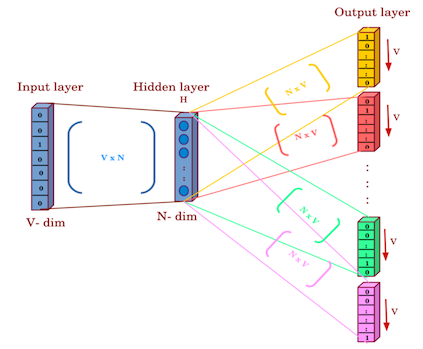

# 人工智能系列：大语言模型的前世今生

## NLP 早期发展（1950-1990s）

### 符号方法与规则系统
早期的 NLP 系统主要基于符号方法和规则系统，例如上下文无关文法（Context-Free Grammar, CFG）。一个上下文无关文法是可以表示为一个四元组：

$$
G = \langle V, \Sigma, R, S \rangle
$$

其中
- $V$ 表示非终结符集合；
- $\Sigma$ 表示终结符集合；
- $R$ 表示产生式规则集合，形如 $A \to \alpha（其中 A \in V，\alpha 为 V \cup \Sigma 上的字符串）$；
- $S$ 是开始符号。

在计算机科学中，如果一个形式文法 $G$ 的产生式规则都取自 $R$ 的形式则称之为上下文无关文法。上下文无关文法取名为“上下文无关”就是因为字符 $A$ 总可以被字符串 $\alpha$ 自由替换，而无需考虑字符 $A$ 出现的上下文。如果一个形式语言是由上下文无关文法生成的，那么可以说这个形式语言是上下文无关的。例如，一个简单的上下文无关文法的例子是： $S \to aSb \mid ab$ ，这个文法就产生了语言 $\{a^nb^n \mid n \ge 1\}$。

上下文无关文法可以用来描述自然语言的句法结构，但是它很难处理自然语言中的歧义和复杂性。

#### 小结
符号方法与规则系统在 NLP 的早期发展中发挥了基础性作用，推动了形式语言理论、可解释系统以及在特定领域的工程应用。它们在可解释性和人类可控性方面依旧有一定优势，并且在语义/知识表示、推理等层面仍有不可替代的价值。
- 理论与方法的奠基 
  - 形式语法与逻辑体系：如上下文无关文法（CFG）、上下文相关文法以及一阶逻辑等，为描述和解析语言提供了形式化工具。它们在语言学和计算机科学的交叉中产生了重要影响，例如编译原理、形式语言理论等。 
  - 语言学传统：符号方法深受乔姆斯基（Noam Chomsky）生成语法理论的影响，也使得对语言的结构化研究进入计算机可处理的范畴。
- 可解释性和可控性 
  - 规则可视化、可理解：符号系统采用明确的规则或产生式，一旦出现错误或异常输出，可以通过查看规则来定位问题，便于维护和调试。 
  - 灵活的人为干预：领域专家可直接修改或新增规则，快速适应某些小范围或特定场景需求。
- 在某些受限领域性能佳 
  - 结构稳定的文本：如法律条文、特定行业文档等，具有较固定的语法和用词。使用规则系统往往能取得较高精度。 
  - 错误率较低，能满足高可靠性需求：在一些对错误容忍度极低的场合（例如医疗报告处理、航空系统），规则系统因其可控性往往更易获得信任。
- 为 NLP 其他方法提供先驱性探索 
  - 早期成功实践：从机器翻译到问答系统，都曾有基于大规模手工规则的实现方式，为后续统计方法、神经网络方法在范式或框架上提供了实验和教训。 
  - 语义/知识表示：在高级语义分析、知识图谱、本体论等工作中，符号主义思想（例如逻辑推理）依然有重要地位。

### 统计语言模型（Statistical Language Model, SLM）（1990s）
统计语言模型是一种基于统计学习的方法，它通过统计分析文本数据中的词汇、句法和语义信息，来学习自然语言的规律。 统计语言模型的目标是计算一个句子的概率，即 $P(w_1, w_2, \ldots, w_n)$，其中 $w_1, w_2, \ldots, w_n$ 是句子中的词汇。

#### N元语言模型（N-Grams） [^1][^2][^3]
该模型解决的问题是预测连续的 $m$ 个词汇组合及其出现概率。该模型基于这样一种假设，第 $m$ 个词的出现只与前面 $m-1$ 个词相关，而与其他任何词都不相关。那么，根据链式规则，一个由 $m$ 个词组成的序列（句子）的概率：

$$
p(w_{1},w_{2}, \ldots ,w_{m})=p(w_{1})*p(w_{2} \mid w_{1})*p(w_{3} \mid w_{1},w_{2}) \ldots p(w_{m} \mid w_{1:m-1})
$$

利用马尔科夫假设，即 

$$
P(w_{m} \mid w_{1:m−1}) = P(w_{m} \mid w_{m−1}) \approx P(w_m \mid w_{m-n+1:m-1}) \quad \text{(Markov assumption)}
$$

化简:

$$
p(w_{1},w_{2}, \ldots ,w_{m})=\prod_{i=1}^m p(w_{i} \mid w_{i-n+1:i-1})
$$

当 $n=2$，二元模型（bigram model）即为：

$$
p(w_{1},w_{2}, \ldots ,w_{m})=\prod_{i=1}^m p(w_{i} \mid w_{i-1})
$$

当 $n=3$ ，三元模型（trigram model）即为：

$$
p(w_{1},w_{2}, \ldots ,w_{m})=\prod_{i=1}^m p(w_{i} \mid w_{i-2}，w_{i-1})
$$

#### 隐马尔科夫模型（Hidden Markov Model, HMM）[^4]
序列标注是自然语言处理中的一项重要任务，涉及为输入序列中的每个元素分配一个标签。常见的序列标注任务包括词性标注、命名实体识别和语义角色标注。HMM 通过观测序列推断隐藏状态序列，用于序列标注任务，其联合概率定义为：

$$
P(S_1, \ldots, S_T,\, O_1, \ldots, O_T) = P(S_1)P(O_1 \mid S_1) \prod_{t=2}^{T} P(S_t \mid S_{t-1})P(O_t \mid S_t)
$$

其中
- $S_{t}$ 表示隐藏状态（如词性标签）；
- $O_{t}$ 表示观测（如单词）。

一个 HMM 标注器（HMM Tagger）通常由两部分组成： $A$ 和 $B$ 两类概率，它们都是通过在带标注的训练语料上进行计数来估计得到的。

- $A$ 矩阵：包含词性转移概率 $P(t_i \mid t_{i-1})$，表示给定前一个词性标注的情况下，下一个词性标注出现的概率（例如一个 MD 之后紧跟一个 VB 的概率）。我们通过在标注语料中统计前一个标注出现的总次数，以及这两个标注连续出现的次数来计算该转移概率的最大似然估计：

$$
P(t_i \mid t_{i-1}) = \frac{C(t_{i-1},\,t_i)}{C(t_{i-1})}
$$

- $B$ 发射概率： $P(w_i \mid t_i)$ 表示给定一个词性（例如 MD）时，该词性会关联到某个具体单词（例如 “will”）的概率。发射概率的最大似然估计为：

$$
P(w_i \mid t_i) = \frac{C(t_i,\,w_i)}{C(t_i)}
$$

> :bulb: 对于任何包含隐藏变量的模型（例如 HMM），从观测序列中确定对应的隐藏变量序列的过程称为解码（decoding）:
> 给定一个 HMM $\lambda = (A, B)$ 和一个观测序列 $O = o_1, o_2, \dots ,o_T$，找到最可能的状态序列 $S = s_1,s_2,s_3, \dots ,s_T$。

在词性标注（part-of-speech tagging, POS tagging）中，HMM 解码的目标是：给定包含 $m$ 个单词 $w_1, w_2, \dots, w_m$ 的观测序列，找到最可能的标注序列 $t_1, t_2, \dots, t_m$：

$$
\hat{t_{1:m}} = \arg\max_{t_1 \dots t_m} P(t_1 \dots t_m \mid w_1 \dots w_m) = \arg\max_{t_1 \dots t_m} \frac{P(w_1 \dots w_m \mid t_1 \dots t_m) \, P(t_1 \dots t_m)}{P(w_1 \dots w_m)}
$$

进一步忽略掉分母，可得：

$$
\hat{t_{1:m}} = \arg\max_{t_1 \dots t_m} P(w_1 \dots w_m \mid t_1 \dots t_m) \, P(t_1 \dots t_m)
$$

HMM 标注器还进一步地做了两个简化假设。

- 输出独立性假设：一个单词出现的概率只依赖于它自身的词性标注，而与邻近的单词和词性无关。

$$
P(o_i \mid s_{1:T}, o_{1:T}) = P(o_i \mid s_i) 
$$

- 马尔可夫假设：某个标注出现的概率只依赖于前一个标注，而不依赖于整个标注序列（参见公式 Markov assumption）。

带入公式，最终得到二元标注器（bigram tagger）最可能的标注序列的计算公式：

$$
\hat{t_{1:m}} \approx \arg\max_{t_1 \dots t_m} \prod_{i=1}^{m} \overbrace{P(w_i \mid t_i)}^{发射概率} \, \overbrace{P(t_i \mid t_{i-1})}^{转移概率} 
$$

#### 小结
统计语言模型开启了 NLP 从规则系统向数据驱动方法转变的先河，在机器翻译、语音识别、文本生成等任务中都曾扮演关键角色，并为后来的神经网络模型奠定了重要的概率论基础。
- 数据驱动的学习 
  - 取语言规律：统计语言模型不需要人工编写规则，而是通过大规模语料库自动估计词与词之间的关系（共现频次、转移概率等），捕捉语言的统计结构。 
  - 可拓展到多语言和领域：只要有足够的训练数据，统计语言模型可以很容易地迁移到不同语言或特定领域（如医学、法律等）。
- 实用性强，易于实现 
  - 计算和实现相对简单：n-gram 模型利用相邻 n 个词的共现概率即可在语音识别、机器翻译等任务中起到重要作用。 
  - 在资源受限的场景可快速部署：小规模的 n-gram 模型在早期和嵌入式系统中尤其常用，因为训练和推断的计算量都较低。
- 为后续深度学习模型提供启示 
  - 提出了语言“上下文”概念：统计语言模型的马尔可夫假设为后来的循环神经网络（RNN）及其变体（LSTM、GRU）等序列模型奠定了“依赖前文预测当前词”的思路。 
  - 形成数据驱动与估计概率的思维方式：现代神经语言模型仍然遵循“通过大规模训练数据来学习概率分布”的核心理念，统计模型算是重要的启蒙与基石。
- 在早期 NLP 任务中效果显著 
  - 语音识别和机器翻译：配合声学模型或翻译模型，统计语言模型可以帮助挑选更合理的词序或翻译结果，显著提升系统性能。 
  - 词预测与文本生成：尽管简单，但在联想输入法、词预测等实际应用中，n-gram 等模型依然能提供较为准确的下一个词猜测。

然而，统计语言模型采用强马尔可夫假设，缺乏对长程依赖和深层语义的捕捉能力，且面临数据稀疏、OOV、语义理解不足等问题，难以满足当代复杂多样的语言需求。
- 上下文依赖短，难以捕捉长距离依赖 
  - 马尔可夫假设过于强烈：n-gram 模型仅关注固定长度 n 的词序，无法有效处理语言中的长程依赖（如主谓一致、跨句关系等）。 
  - 依赖窗口限制：当 n 很大时，数据的稀疏性和计算量都会急剧上升，使得模型难以扩展。
- 数据稀疏性问题 
  - 无法估计低频或未出现词序的概率：即使使用平滑方法（加法平滑、Kneser-Ney 平滑等），也难以完全解决“词组或 n-gram 未被语料覆盖”导致的概率估计不准确问题。 
  - OOV（Out Of Vocabulary）问题严重：统计语言模型往往依赖固定词表，词表之外的新词在预测或生成时会被视为未知词，导致模型退化。
- 难以捕捉语义和上下文深层含义 
  - 只关注表层统计：统计语言模型基于词频和转移概率，缺乏对上下文真正语义的理解，难以处理歧义、同义、上下文推理等复杂语言现象。 
  - 缺少结构化信息：无法直接使用句法、语义等高层次结构来推断句子背后的含义。
- 扩展到多模态、复杂语境时能力有限 
  - 缺乏跨模态信息融合：统计语言模型通常只基于文本形式，无法处理图像、音频、视频等多模态输入的语义关联。 
  - 在开放域任务上表现不足：若要在开放域对话、文本摘要等需综合多方面知识的任务中应用，统计语言模型力不从心，性能显著落后于深度学习模型。
- 难以与大规模分布式训练和并行化配合 
  - 与深度模型的融合困难：简单的 n-gram 语言模型很难直接与当今主流的神经网络进行联合训练（除了一些混合方法外）。 
  - 训练效率和推断方式受限：n-gram 模型依赖在巨大语料上统计共现频率，随着词表和 n 增大，模型参数与存储需求也会显著增多，难以灵活扩展。

## 神经网络崛起（2000s-2010s）
### 词嵌入（Word Embedding）
传统的 NLP 方法多采用独热（one-hot）编码表示词汇，这种表示方式维度高且无法捕捉词与词之间的语义关系。

> :bulb: 假设词汇表长度是5000，词汇的独热表示可能是
$$
\begin{matrix}
\text{我} \\
\text{爱} \\
\text{学} \\
\text{习} \\
\end{matrix}
\,
\overbrace{\begin{bmatrix}
1 & 0 & 0 & \cdots & 0 \\
0 & 1 & 0 & \cdots & 0 \\
0 & 0 & 1 & \cdots & 0 \\
0 & 0 & 0 & \cdots & 1
\end{bmatrix}}^{5000}
$$

词嵌入（或分布式表征）技术通过将词汇映射到低维连续的向量空间，使得语义上相似的词在向量空间中距离更近，从而捕捉词汇之间的语义和句法信息。其中较为著名的方法有 Word2vec[^5] 和 GloVe[^6]。

> :bulb: Word2vec 的分布式表征都是静态词嵌入，意思是该方法为词汇表的每个单词学习一个固定的嵌入。这和目前 BERT 流行的表征系列中的动态上下文嵌入方法有所不同，其中每个单词的向量在不同的上下文中是不同的。

以 Word2vec 的 Skip-Gram 模型为例，其目标是最大化给定中心词预测其上下文词的概率，通过优化目标函数来实现。在训练过程中，Skip-Gram模型使用Softmax函数计算概率，并通过随机梯度下降等优化算法更新词嵌入向量。最终，模型训练仅保留中心词的嵌入向量作为词向量。Skip-Gram 是一个浅层神经网络，网络结构如下：

- 输入层（Input Layer）
  输入是中心词的 one-hot 编码，维度为词汇表大小 $V$。例如，“爱”的 one-hot 编码 “010...0”。实际上 one-hot 编码这里仅起到索引的作用。
- 隐藏层（Hidden Layer）
  输入层与隐藏层之间通过权重矩阵 $W$（维度 $V \times N$， $N$ 是词向量维度，通常 100-500维）连接。隐藏层输出是中心词向量：$$v_c = W^{T} \cdot x$$ $x$ 是中心词的 one-hot 向量，$v_c$ 是维度为 $N$ 的向量。
- 输出层（Output Layer）
  隐藏层与输出层之间通过权重矩阵 $W'$ （维度 $N \times V$）连接。对于每个上下文位置，输出层计算所有词的得分，并通过 Softmax 转换为概率：$$p(w_{t+j} \mid w_t) = \frac{\exp({v_{w_{t+j}}^T} \cdot v_c)}{\sum_{k=1}^{V}\exp({v_{w_k}}^T \cdot v_c)}$$ $j$是窗口内的偏移，$w_{t+j}$ 是上下文词汇。

模型的网络结构图如下：

{style="display:block; margin:0 auto; width:50%"}

Skip-Gram 模型的训练目标是最大化所有上下文词汇的条件概率，损失函数为负的对数似然：

$$
L = -\frac{1}{T} \sum_{t=1}^{T} \sum_{-c \le j \le c,; j \ne 0} \log \, p(w_{t+j} \mid w_t)
$$

其中， $T$ 表示句子长度， $c$ 为上下文窗口大小。较大的窗口捕捉更多主题信息，较小的窗口关注局部语法。

模型通过反向传播更新权重矩阵 $W$ 和 $W'$，训练完成后，通常使用 $W$ 或 $W + W'$ 作为最终的词向量。

> :bulb: 在 Word2vec 的 Skip-Gram 模型中，负采样（Negative Sampling）是一种优化技术，用于替代原始的 Softmax 损失函数，从而减少计算复杂度。负采样的核心思想是：只更新正样本（真实上下文词）和少量负样本（随机采样的非上下文词）的权重，而不是更新整个词汇表的权重。负采样将计算复杂度从 $O(V)$ 降低到 $O(K+1)$ （ $K$ 是负样本数量），特别适合大规模词汇表，在实践中表现良好，几乎能达到与 Softmax 相当的效果。

#### 小结
词嵌入是 NLP 迈向神经网络和深度学习的重要里程碑，让计算机在向量空间中理解和操作语言语义成为可能，并作为一种高效的通用表示在众多下游任务中取得显著性能提升。然而，静态词向量无法动态捕捉语境化含义，对于多义词、语言偏见以及复杂语法结构的处理能力有限。而随着上下文化嵌入（如 BERT、GPT 等）的兴起，词向量技术本身也不断演化，逐渐融入到更大、更智能的语言模型之中。

### 循环神经网络（RNN/LSTM）

### Seq2Seq与注意力机制（2014-2017）

## 预训练时代（2017-2020）
### Transformer架构（2017）
### 预训练范式突破（2018-2019）
#### BERT（Devlin et al., 2018）
#### GPT（Radford et al., 2018-2019）

## 大语言模型时代（2020至今）
### 模型规模化（Scaling Laws）
### 稀疏专家模型（MoE）
### 对齐与指令微调

## 参考文献
[^1]: Kuhn, T. S., & Morris, R. N. (1964). Statistical grammar and phrase recognition. IEEE Transactions on Communication Theory, 12(3), 333-345.
[^2]: Shannon, C. E. (1975). Prediction and entropy of printed English. MIT Press.
[^3]: Ney, H., Martin, A., & Kübler, N. (1975). A statistical interpretation of text-generating devices with application to the problem of speech recognition. IEEE Transactions on Information Theory, 21(6), 624-630.
[^4]: Baum, L. E., Petrie, T., Soules, G., & Weiss, N. (1970). A maximization technique occurring in the statistical analysis of probabilistic functions of Markov chains. The annals of mathematical statistics, 41(1), 164-171.
[^5]: Mikolov, T., Chen, K., Corrado, G., & Dean, J. (2013). Efficient Estimation of Word Representations in Vector Space. arXiv preprint arXiv:1301.3781.
[^6]: Pennington, J., Socher, R., & Manning, C. D. (2014). GloVe: Global Vectors for Word Representation. EMNLP.
